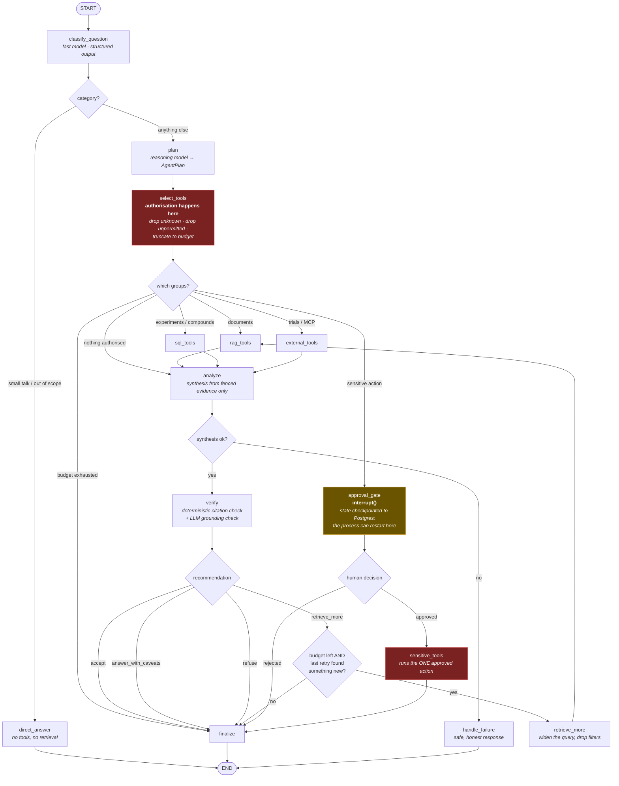

# Agent workflow

The graph in `app/agents/graph.py`. Every box is a node; every diamond is a
routing function that is a pure function of state (and therefore unit tested
in `tests/unit/test_agent_routing.py`).

## The three branches that matter

**Fan-out.** `route_tools` returns a *list* of node names, so LangGraph starts
those branches concurrently. A question needing both literature and trial data
pays for one round trip, not two. The concurrent branches all write to
`tool_results` and `evidence`, which is why those state keys carry
`operator.add` reducers.

**The retrieval loop is doubly bounded.** It stops on the iteration budget
*and* on "the last retry added no new evidence" — re-running a query that
already returned nothing only costs latency and tokens.

**The approval pause is a real pause.** `interrupt()` checkpoints the entire
state to Postgres and returns control. The run resumes minutes later, possibly
in a different container, with `Command(resume=...)`. That constraint is why
the agent state is strictly JSON-serialisable.

## Bounded autonomy

| Bound | Setting | What it prevents |
|---|---|---|
| Iterations | `MAX_AGENT_ITERATIONS` | An infinite "evidence is insufficient" loop |
| Tool calls | `MAX_TOOL_CALLS` | Fan-out across the whole run |
| Wall clock | `MAX_RUNTIME_SECONDS` | One slow dependency hanging a request |
| Supersteps | `recursion_limit=40` | A cycle the budget logic somehow misses |

Exceeding a budget is a first-class outcome (`status=budget_exceeded`), not an
exception: the run returns the evidence it did gather and says it was truncated.
