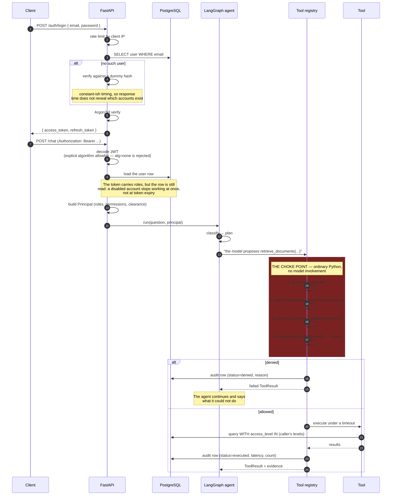

# Authentication and authorisation

## The rule the whole design rests on

**The LLM is not the security boundary.**

The model may *request* a tool call. Whether that call runs is decided in
`app/tools/registry.py` against the authenticated principal. There is no code
path where a string produced by a model, or found in a retrieved document, can
cause step 2 to be skipped.

## Layers

| Layer | Mechanism | Where |
|---|---|---|
| Authentication | OAuth2 bearer, JWT HS256, explicit algorithm allowlist | `app/core/security.py` |
| Password storage | Argon2id via pwdlib | `app/core/security.py` |
| Role → permissions | Flat permission strings on the role row | `app/auth/permissions.py` |
| Route authorisation | `require_permissions(...)` dependency | `app/auth/dependencies.py` |
| Tool authorisation | Registry check before execution | `app/tools/registry.py` |
| Row filtering | `access_level IN (...)` in every query | `app/rag/retriever.py`, `app/tools/sql_tools.py` |
| Resource ownership | `owns_or_can_read_any` | `app/auth/permissions.py` |
| Write path | Human approval + separate permission | `app/tools/sensitive.py` |
| Database | A role Postgres restricts to `SELECT` | `docker/postgres/init.sql` |

## The role matrix

| | researcher | senior_researcher | admin |
|---|---|---|---|
| Read public + internal documents | yes | yes | yes |
| Read restricted documents | **no** | yes | yes |
| Upload documents | yes | yes | yes |
| Run the agent | yes | yes | yes |
| Approve sensitive actions | **no** | yes | yes |
| Delete/archive documents | **no** | yes | yes |
| Sensitive tools permission | **no** | **no** | yes |
| Read anyone's agent runs | **no** | **no** | yes |

The roles are strictly nested, and a unit test asserts that
(`test_roles_are_strictly_nested`) so a permission cannot be added to one role
and silently forgotten in another.

## Three independent controls on a write

A sensitive action must clear all three:

1. **Human approval** — the run pauses at `approval_gate` and cannot proceed
   without an explicit decision.
2. **Segregation of duties** — the approver must not be the requester.
3. **Permission** — approval is not a substitute for authorisation. A
   researcher whose archive request is approved by an admin *still* fails,
   because the researcher lacks `documents:delete`. This is verified in
   `test_approval_does_not_grant_missing_permissions`.
