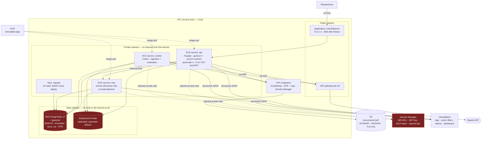
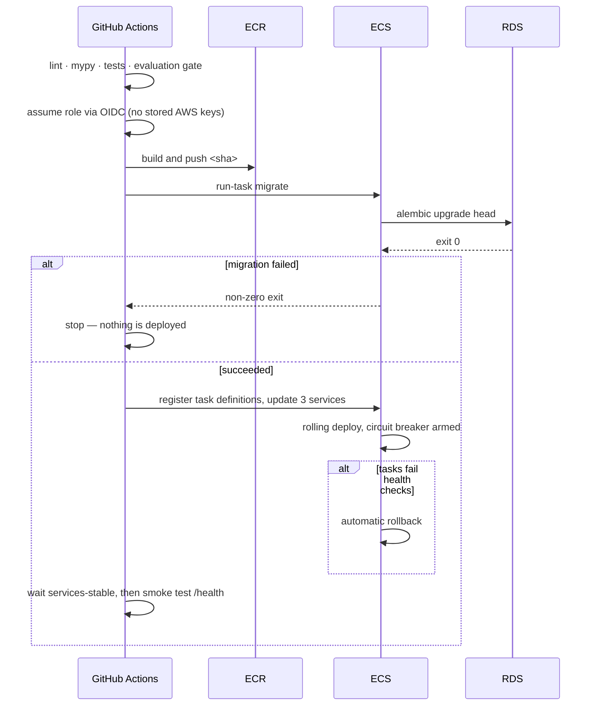

# AWS deployment

## Deployment sequence

Migrations run as a **one-off task before** any new application task starts.
Running them on container start would race several tasks against the same DDL.

## The network story

Three tiers, each accepting traffic only from the one above:

* **public** — the load balancer and NAT. Nothing else.
* **private** — every ECS task. No inbound from the internet; outbound only via
  NAT (for the model provider) or VPC endpoints.
* **data** — RDS and ElastiCache on a route table with **no default route**.
  They have no path off the VPC in either direction.

S3, ECR, CloudWatch Logs and Secrets Manager are reached through VPC endpoints,
so image pulls, secret reads and log writes do not depend on NAT being healthy
and document bytes never traverse it.

## Secrets

Nothing sensitive is ever a plaintext environment variable in a task
definition. Secrets Manager ARNs go in `secrets`/`valueFrom` and the ECS agent
injects the values at task start, so they never appear in the task definition,
in `docker inspect`, or in CloudTrail.

Two IAM roles per task, which is the distinction most often collapsed:

* the **execution role** is used *by ECS* to pull the image, read the injected
  secrets and create the log stream;
* the **task role** is used *by the application* at runtime, and can reach S3's
  `documents/` prefix and nothing else.

Collapsing them would let application code — which is running
model-influenced tool calls — read every secret in the task definition.

The OpenAI key is created **empty** and its version carries `ignore_changes`.
Terraform should not be the system of record for a third-party credential, and
until someone sets it the application falls back to its deterministic offline
provider rather than refusing to start.

## What CloudWatch actually watches

The application emits one wide JSON event per agent run, so metric filters turn
logs into metrics with no extra infrastructure. That makes it possible to alarm
on **AI-specific** failure modes, not just CPU:

| Alarm | Signal | Why it matters |
|---|---|---|
| `agent-cost-spike` | Hourly model spend > $50 | A retry loop is expensive before it is visible |
| `ungrounded-answers` | Verifier rejections in 15 min | A quality regression no latency dashboard would show |
| `llm-failures` | Provider calls failing after retries | The model provider is degraded |
| `api-latency-p95` | p95 > 30s | User-visible slowness |
| `worker-stopped` | Running worker tasks < 1 | Ingestion has silently stalled |
| `rds-cpu` | > 80% | Usually an unindexed query or a vector scan |

## What still has to be done by hand

Deliberately not in Terraform:

1. **Set the model provider key** — `aws secretsmanager put-secret-value`.
2. **Create the read-only database role** — in-database DDL
   (`docker/postgres/init.sql`), not infrastructure.
3. **Seed demo data** — never in production.

`terraform output post_apply_steps` prints these.
