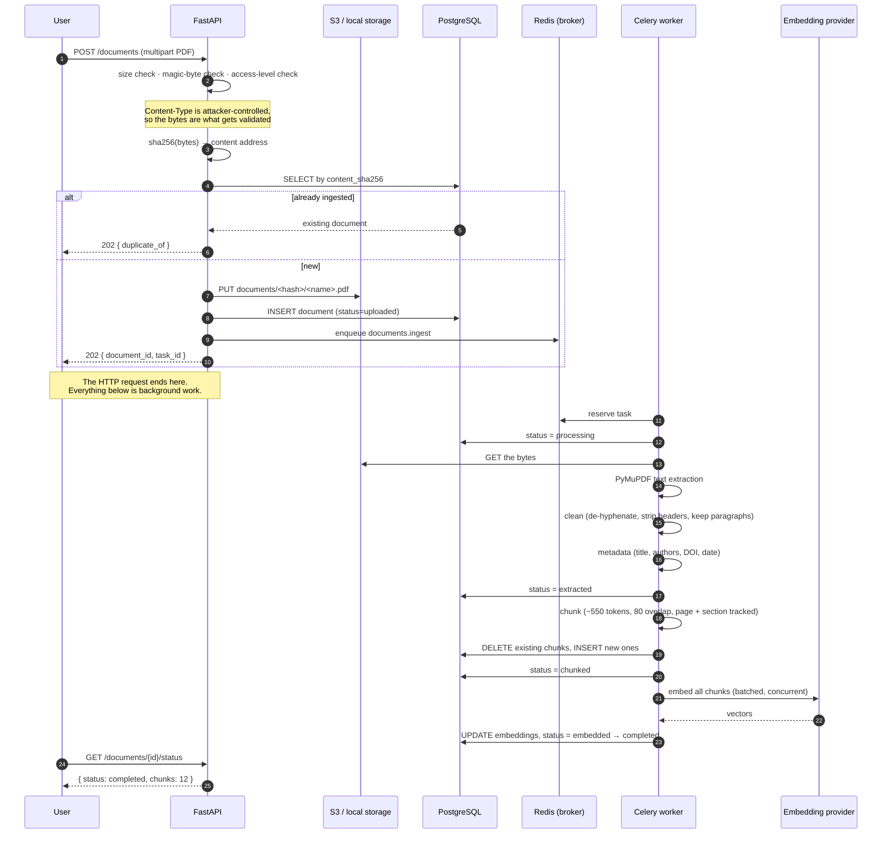

# Document ingestion



## The state machine

```
uploaded → processing → extracted → chunked → embedded → completed
                 │
                 └──────────────────────────────────────→ failed
```

Persisted on `documents.ingestion_status`, which is what makes the pipeline
restartable and the UI pollable.

## Why none of this is in the request

Extraction and embedding are seconds to minutes of CPU and network. Inline,
they would hold a worker, blow past any sane gateway timeout, and lose all
progress if the client disconnected. The request does four cheap things —
validate, hash, store, insert — and returns 202 with an id to poll.

## Idempotency, because Celery is at-least-once

`acks_late=True` means a task is only acknowledged after it completes, so a
worker killed mid-ingestion (spot reclaim, deploy, OOM) returns the task to the
queue. That is only safe because the pipeline converges on the same result when
run twice:

* the storage key is the content hash, so re-uploading identical bytes is a no-op;
* chunking deletes this document's chunks before inserting, so a retry replaces
  rather than duplicates;
* embeddings are recomputed deterministically for the chunks that exist.

## Retry policy

Only transient classes retry (`EmbeddingError`, `ExternalServiceError`,
connection and OS errors) with exponential backoff and jitter, capped at four
attempts. A `ValidationError` — a corrupt PDF, a scanned image with no text
layer — is **not** retried: repeating it just delays the failure and triples the
log noise. The document lands in `failed` with the reason recorded and visible
in the UI.
