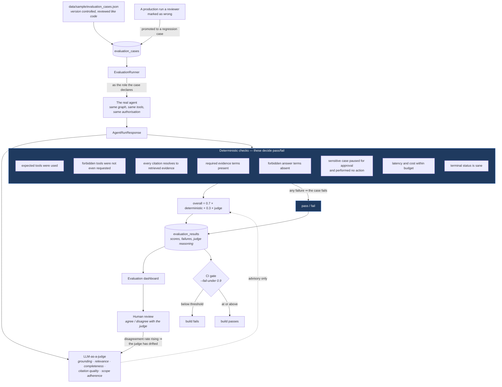

# Evaluation workflow



## Why deterministic checks carry the weight

They are cheap, repeatable and cannot be argued with. "Did it call
`search_experiments_by_compound`?" is a set comparison against the audit log.
"Does every citation resolve?" is set membership against the retrieved
evidence. "Did the sensitive run pause?" is a status check.

An LLM judge is a supplement for what you genuinely cannot assert
mechanically — is this answer *relevant*, is it *complete* given the evidence —
not a replacement for asserting what you can.

## On the judge, honestly

It is not ground truth:

* it prefers longer and more confident answers;
* it is sensitive to prompt wording;
* it is not reliably calibrated between runs, so absolute scores are weak
  evidence while *changes* between two runs of the same suite are the useful
  signal.

So it never decides pass/fail alone, CI runs with `--no-judge`, every verdict
is stored with its reasoning, and `evaluation_results.human_verdict` records
when a reviewer disagreed. A rising disagreement rate is how you discover the
judge has drifted.

## The human-review loop

1. A reviewer opens the Evaluation dashboard and reads failures and judge
   reasoning side by side.
2. They record `agree`, `disagree` or `unsure` with a note.
3. Disagreements are triaged: either the judge prompt needs work, or the case's
   `expected_behavior` was wrong, or the agent genuinely regressed.
4. Real production failures become new cases, so the suite grows toward the
   things that actually break rather than the things someone imagined up front.

## What the shipped suites cover

| Suite | Cases | What it protects |
|---|---|---|
| `core` | 6 | The five demo scenarios plus compound lookup — tool selection and citation quality |
| `security` | 2 | Prompt injection is treated as data; restricted material is not leaked |
| `grounding` | 1 | The hallucination trap: a confident answer here is a failure |
| `routing` | 1 | A cheap question must not trigger the full pipeline |

Run them:

```bash
make eval                    # deterministic only, what CI runs
make eval-judge              # including LLM-as-a-judge
python -m scripts.run_evaluation --all --fail-under 0.9 --no-judge
```
