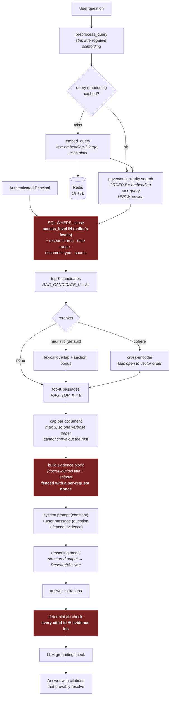

# RAG pipeline

## Decisions worth defending

**Embedding width is 1536, not 3072.** `text-embedding-3-large` is natively
3072-dimensional, but pgvector's HNSW index on the `vector` type tops out at
2000 dimensions. The options were: no index (sequential scan over every
chunk), the `halfvec` type (indexable to 4000 dims at half precision), or a
shortened embedding. We request 1536 dimensions from the API — these models are
Matryoshka-trained, so a truncated embedding is still coherent — and keep a
normal HNSW index. `EMBEDDING_DIM` is configurable and validated in Terraform.

**Cosine distance.** OpenAI embeddings are L2-normalised, so cosine and inner
product rank identically; cosine is what `vector_cosine_ops` indexes and what
everyone expects to read as "similarity". Reported as `1 - distance`, so higher
is better.

**Document context is prepended before embedding.** A chunk from the middle of
a paper often says "the treatment group improved" with no clue which treatment
or which disease. Embedding `title — section (research area)` alongside the
chunk text makes the vector reflect what the passage is actually about.

**The similarity floor is deliberately low (0.05).** Cosine distributions are
model-specific: a threshold tuned for one embedding model silently discards
valid hits from another. Top-K plus reranking does the filtering; the floor
only removes noise. Tune it from evaluation data, not intuition.

**Citation ids are short and stable.** `doc:<uuid8>:<chunk_index>` is cheap for
a model to echo verbatim, and because the valid set is known the verifier can
catch a fabricated citation by set membership rather than by asking a model to
be careful.

## Where this would change at scale

At tens of millions of chunks: partition `document_chunks` by research area or
tenant, tune `hnsw.ef_search` per query class, and add a cheap lexical
pre-filter (`pg_trgm` or a `tsvector` column) so the vector search runs over a
smaller candidate set. Beyond that, a dedicated vector store starts to earn its
operational cost — but not before, because keeping vectors in the same
transactional database as the metadata is what makes the access-level filter a
single WHERE clause instead of a distributed join.
