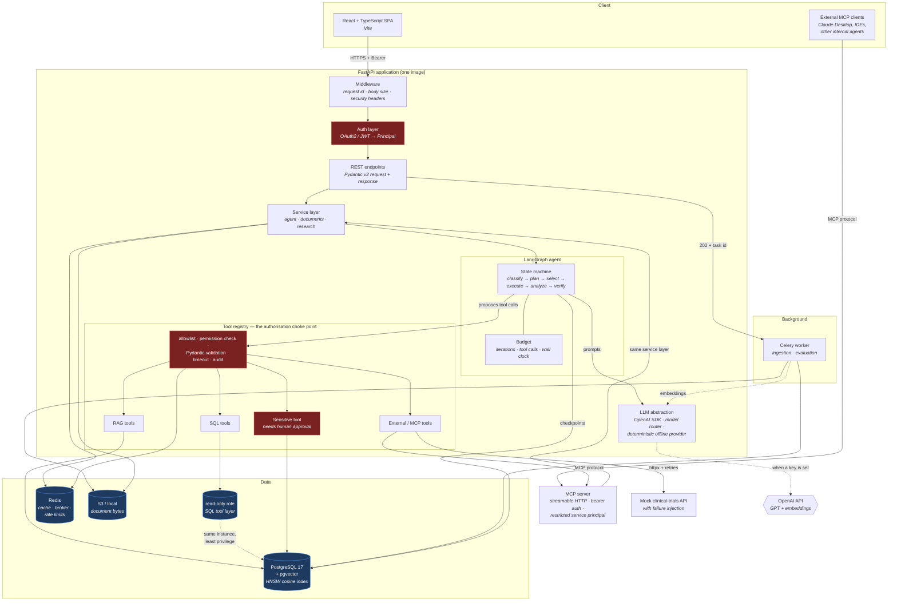

# System architecture

One modular monolith plus three small satellites, not a constellation of
microservices. The API, the Celery worker, the MCP server and the mock
clinical-trials API are the **same container image** with different commands,
so what CI tested is byte-for-byte what runs.

## Why this shape

**One image, several commands.** The API, worker and MCP server share all their
domain code. Splitting them into separate repositories or images would mean
three deploys to change one tool, and three chances for the tool contract to
drift.

**The tool registry is the only path to a tool.** Everything the agent can do
goes through one function that checks the allowlist, checks the caller's
permissions, validates arguments against a Pydantic model, applies a timeout
and writes an audit row. There is no second path.

**Two database roles, one instance.** Normal application access uses the owner
role. The SQL tool layer connects as `research_ro`, which Postgres itself
restricts to `SELECT`. That is a database-enforced guarantee rather than an
application promise.

**MCP is a transport, not a second implementation.** The MCP server calls the
same `ResearchService` the REST API calls. It exists so that consumers outside
this codebase get typed, discoverable tools without a bespoke integration.
